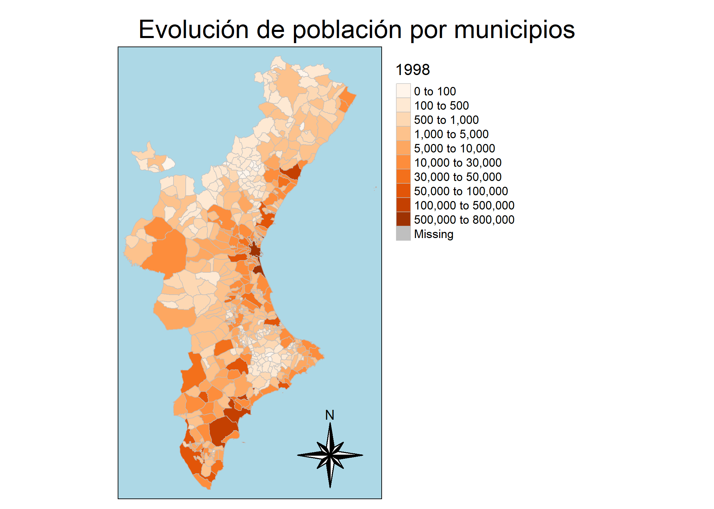

```{r setup, include=FALSE}
knitr::opts_chunk$set(echo = TRUE)
```

```{r}
##LIBRERÍAS:
library(readxl)
library(dplyr)
library(stringr)
library(mapview) 
library(animation)
library(sf)
library(raster)
library(dplyr)
library(tidyr)
library(spData)
library(tmap) 
library(tmaptools)

```

```{r, include=FALSE}
rm(list=ls())
```

En primer lugar, cargamos los datos por provincias:
```{r, include=FALSE}
Alicante <- read_excel("Data/2856.xls", skip = 7)
Castellon <- read_excel("Data/2865.xls", skip = 7)
Valencia<- read_excel("Data/2903.xls", skip = 7)
```


Vemos que la primera fila de cada data frame se corresponde con los habitantes de toda la provincia. Por este motivo se elimina esta fila en cada uno:

```{r}
sum(Alicante[2:142,2])==Alicante[1,2]
sum(Castellon[2:136,2])==Castellon[1,2]
sum(Valencia[2:267,2])==Valencia[1,2]

Alicante<-Alicante[-1,]
Castellon<-Castellon[-1,]
Valencia<-Valencia[-1,]
```

Ahora, se seleccionan los datos totales para cada provincia:


```{r}
#Se eliminan las columnas correspondientes al año 1997 ya que no contiene datos.

Alicante_total<-Alicante%>%dplyr::select(1:22)%>%slice(1:141)

Castellon_total<-Castellon%>%dplyr::select(1:22)%>%slice(1:135)

Valencia_total<-Valencia%>%dplyr::select(1:22)%>%slice(1:266)


ComVal_total<-rbind(Alicante_total,Castellon_total,Valencia_total)
colnames(ComVal_total)<-str_sub(colnames(ComVal_total),1,4)
ComVal_total<-ComVal_total%>%rename(Nombre=1)

#Eliminamos variables:

rm(Alicante,Alicante_total,Castellon,Castellon_total,Valencia,Valencia_total)
```


Guardamos el mapa de la Comunidad Valenciana:

```{r}
library(raster)
library(tmap)
SpainRegions_mun <- getData('GADM', country='ESP', level=4)
SpainRegions_mun<-SpainRegions_mun[SpainRegions_mun@data[["NAME_1"]]=="Comunidad Valenciana",]
```

Se van a limpiar los nombres de los municipios del data set `ComVal_total` de forma que coincida con los nombres de los municipios guardados en el objeto mapa, para posteriormente poder asociar los datos de la población con el mapa:

```{r}

ComVal_total[[1]]<-str_to_lower(str_sub(ComVal_total[[1]], 6))

for (i in seq(1:length(ComVal_total[[1]]))){
  
 if (str_detect(ComVal_total[[i,1]],"/")==TRUE){
   if(sum(str_to_title(str_trim(str_sub(ComVal_total[[i,1]], 1, str_locate(ComVal_total[[i,1]], "/")[1]-1)))== str_to_title(SpainRegions_mun@data[["NAME_4"]]))>=1){
    
    ComVal_total[[i,1]]<- str_sub(ComVal_total[[i,1]], 1, str_locate(ComVal_total[[i,1]], "/")[1]-1)
   }else{
     ComVal_total[[i,1]]<- str_sub(ComVal_total[[i,1]], str_locate(ComVal_total[[i,1]], "/")[1]+1, str_length(ComVal_total[[i,1]]))
   }
 } else{}
 if ((str_detect(ComVal_total[[i,1]],","))==TRUE){
      ComVal_total[[i,1]]<-str_c(str_sub(ComVal_total[[i,1]],-3),ComVal_total[[i,1]],                              sep = "", collapse = NULL)
      ComVal_total[[i,1]]<-str_to_title(str_trim(str_trunc(ComVal_total[[i,1]],                             str_length(ComVal_total[[i,1]])-(str_length(ComVal_total[[i,1]])-str_locate(ComVal_total[[i,1]], ",")[1]+1), "right","")))
     }else{
      ComVal_total[[i,1]]<-str_to_title(str_trim(ComVal_total[[i,1]]))
     }
}

```


```{r}
SpainRegions_mun@data[["NAME_4"]]<-str_to_title(str_replace_all(SpainRegions_mun@data[["NAME_4"]],"L'", "L' "))

```


```{r}
#Estos tres municipios se asocian de forma manual:

ComVal_total$Nombre[which(ComVal_total$Nombre=="Sant Joanet")]<-"San Juan De Énova"
ComVal_total$Nombre[which(ComVal_total$Nombre=="El Puig De Santa Maria")]<-"Puig"
ComVal_total$Nombre[which(ComVal_total$Nombre=="Real")]<-"Real De Montroi"
x<-ComVal_total$Nombre[!(ComVal_total$Nombre%in%SpainRegions_mun@data$NAME_4)]
y<-setdiff(SpainRegions_mun@data$NAME_4,ComVal_total$Nombre)


for (mun in x) {
  ComVal_total$Nombre[which(ComVal_total$Nombre==mun)]<-y[which.min(adist(mun,y,partial = FALSE))]
}

#Vemos que todos los nombres coinciden:
setdiff(SpainRegions_mun@data$NAME_4,ComVal_total$Nombre)
rm(x,y,mun,i)
```

```{r}
#Se asocian los datos de población con el mapa:
MunComVAL<-sp::merge(SpainRegions_mun,ComVal_total,by.x="NAME_4",by.y="Nombre")
```
```{r}
breaks<-c(0,100,500,1000,5000,10000,30000,50000,100000,500000,800000)
paleta<-get_brewer_pal("Oranges", n = 10, contrast = c(0, 0.9))
```

Dibujamos el mapa correspondiente al año 2018:

```{r}
tmap_mode("plot")

mapa<-tm_shape(MunComVAL)+tm_fill("2018",palette=paleta,convert2density = F,style = "fixed",breaks = breaks)+tm_borders(col="grey",lwd=0.3,alpha=0.5)+tm_layout(bg.color = "lightblue", legend.show = T,legend.outside = T,legend.outside.position = c("right","bottom"),main.title = "Población por municipios",main.title.position  = c("center","top"))+tm_compass(type = "8star", show.labels= 1, position = c("right", "bottom"))

print(mapa)

```

Ahora, dibujamos loas mapas por año:

```{r}
tmap_mode("plot")
for (j in seq(1998,2018,1)[-2]){
  mapa<-tm_shape(MunComVAL)+tm_fill(paste(j),palette=paleta,n=10,convert2density = F,style = "fixed",breaks =breaks)+ tm_borders(col="grey",lwd=0.9,alpha=0.7)+ tm_layout(bg.color = "lightblue",legend.show = T,legend.outside = T,legend.outside.position = "right",main.title = "Población por municipios",main.title.position  = c("center","top"))+tm_compass(type = "8star", show.labels= 1, position = c("right", "bottom"))
  print(mapa)
}
```


Finalmente, se crea un gif que muestre la evolución de la población de la Comunidad Valenciana entre los años 1998 y 2018:

```{r}
tmap_mode("plot")

mapa_animation<-  tm_shape(MunComVAL)+tm_fill(col=paste0(seq(1998,2018,1)[-2]) ,palette=paleta,style = "fixed",breaks = breaks)+tm_borders(col="grey",lwd=0.9,alpha=0.7)+tm_layout(main.title = c("Evolución de población por municipios") ,bg.color = "lightblue",legend.show = T,legend.outside = T,legend.outside.position = c("right","bottom"),main.title.position  = c("center","top"))+tm_facets(nrow = 1,ncol = 1, free.coords = FALSE)+tm_compass(type = "8star", show.labels= 1, position = c("right", "bottom"))

tmap_animation(mapa_animation, "evolucion_pob.gif",delay=50)

```


```{r}
save(MunComVAL,file="MunComVAL.RData")
```